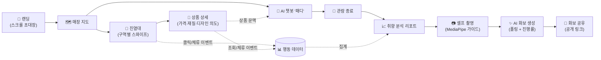

<div align="center">

# 🐻 O&O — MCM 인터랙티브 스토어 (Frontend)

**오프라인 매장 방문 경험을 모바일 웹으로 확장하는 인터랙티브 팝업스토어 컴패니언**

_2026 멋쟁이사자처럼 중앙 해커톤 · 1조 오레오(O&O)_


</div>

---

## 📌 프로젝트 소개

**O&O**는 MCM 팝업스토어 방문객을 위한 모바일 웹 서비스입니다. 방문객은 매장 입구의 QR로 접속해 다음 경험을 이어갑니다.

1. **스크롤 초대장(랜딩)** 으로 브랜드 무드에 몰입하며 입장하고,
2. **인터랙티브 매장 지도**에서 관심 구역을 골라 동선을 잡고,
3. **디지털 진열대**에서 실제 매대와 같은 배치의 상품을 살펴보고,
4. **AI 챗봇 '패디'** 에게 상품에 대해 질문하고,
5. **셀프 촬영 → AI 화보(룩북) 생성**으로 나만의 브랜드 화보를 만들어 공유하고,
6. 관람을 마치면 행동 데이터를 분석한 **취향 리포트**를 받습니다.

프론트엔드는 화면만 그리는 것이 아니라 **상품 조회·체류시간·질문 같은 행동 이벤트를 수집해 백엔드로 전송**하고, 이 데이터가 리포트와 화보 추천의 재료가 됩니다. 즉, "구경 → 대화 → 촬영 → 분석"이 하나의 데이터 루프로 연결된 서비스입니다.

## 🗺️ 한눈에 보는 사용자 여정



## ✨ 핵심 기능 상세

### 1. 🗺️ 인터랙티브 매장 지도

- SVG 기반 평면도에서 구역(zone)을 탭하면 해당 진열대 화면으로 이동합니다.
- 구역 클릭(`scene_click`)이 행동 이벤트로 기록되어 리포트의 "가장 관심을 보인 구역" 분석에 쓰입니다.
- 📁 `components/FloorMap`, `pages/MapPage.jsx`

### 2. 🧱 디지털 진열대 & 상품 상세

- 7개 구역의 진열대를 **Swiper 캐러셀**로 좌우 스와이프하며 탐색합니다. 구역별로 레이아웃이 다르며(행거형 `Shelf05`, 특수 배치 `Shelf04`/`Shelf07`), 실제 매대 배치를 그대로 재현했습니다.
- 인접 구역 이미지를 **미리 디코드(preload)** 해서 스와이프 전환 시 이미지가 늦게 뜨는 현상을 제거했습니다.
- 상품을 탭하면 상세 화면에서 **가격 · 재질 · 디자인 의도**를 팝업으로 확인할 수 있고, 서버 색상 속성(`attributes.color`)을 정규화해 표시합니다.
- 상품 클릭은 `hotspot_click` + 채팅 타임라인 기록(`product_click`)으로 이중 수집됩니다.
- 📁 `components/Shelf`, `pages/ProductPage.jsx`, `components/Product/ProductInfo.jsx`, `hooks/useProductDetail.js`

### 3. 💬 실시간 AI 챗봇 '패디'

- 방문객이 보고 있는 **상품 문맥을 담아 대화**합니다. 진열대·상품 클릭이 채팅 타임라인에 자연스럽게 섞여, 챗봇이 "지금 이 상품"에 대해 답할 수 있습니다.
- **3초 주기 폴링**으로 서버 타임라인과 동기화하며, 요청 순번(sequence) 검사로 늦게 도착한 응답이 최신 메시지를 덮어쓰는 레이스 컨디션을 차단합니다.
- 서버가 먼저 말을 거는 **선제 트리거(pending action)** 를 지원합니다 — 예: 특정 행동 패턴이 감지되면 챗봇이 선택지를 제안하고, 사용자의 응답을 서버로 회신합니다.
- 로컬에서 즉시 추가된 메시지(`local-`/`stream-` ID)는 서버 동기화 시에도 유실되지 않도록 병합하며, 시스템용 클릭 로그는 UI에서 숨깁니다.
- 📁 `pages/ChatPage.jsx`, `hooks/useChatSync.js`, `stores/useChatStore.js`

### 4. 📷 셀프 촬영 → ✨ AI 화보(룩북) 생성

프론트에서 **온디바이스 AI 전처리**까지 수행하는 파이프라인입니다.

| 단계 | 내용 |
| --- | --- |
| ① 촬영 | `getUserMedia` 카메라 스트림 + 인물 가이드 프레임 (`pages/CameraPage.jsx`) |
| ② 온디바이스 분석 | **MediaPipe Face Detection**으로 얼굴 수·비율·중심 좌표를 추출하고, **Selfie Segmentation**으로 인물 마스크를 생성 (8초 타임아웃, 실패 시 원본만으로 진행하는 Graceful Fallback) |
| ③ 업로드 | 원본 사진 + 마스크를 presigned 업로드 (`api/photoUpload.js`) |
| ④ 생성 요청 | 리포트에서 고른 상품 ID와 함께 화보 생성 작업 시작, `job_id`/`share_slug` 발급 |
| ⑤ 폴링 | 서버가 알려준 주기(`poll_after_ms`)로 작업 상태를 조회하며 로딩 화면에 **진행률 표시** (`hooks/useLookbookPolling.js`) |
| ⑥ 완성·공유 | 완성 화보를 **공개 공유 링크**(`/lookbook/:shareSlug`)로 열람 — 방문 인증 없이 누구나 접근 가능. 재생성 횟수 제한(remaining_regenerations)도 관리 |

- 상태 코드별 사용자 친화 에러 처리: 400(입력 확인) · 403(인증 불일치) · 409(리포트 분석 미완료) · 429(재생성 횟수 소진)
- 📁 `hooks/usePhotoLookbook.js`, `hooks/useLookbookPolling.js`, `utils/mediaPipeHelper.js`, `pages/LookbookPage.jsx`

### 5. 📈 방문 취향 분석 리포트

- 관람 종료 시 수집된 이벤트(구역 클릭, 상품 조회 `product_view`, 체류시간 `product_dwell`, 질문)를 백엔드가 집계하고, 프론트는 **폴링으로 리포트 완성을 대기**한 뒤 결과를 렌더링합니다.
- **총 관람시간, 가장 관심 있던 구역, 상품별 관심도 Top 순위**를 카드 UI로 보여주고, 관심 상품 중에서 화보에 쓸 상품을 선택해 촬영으로 이어집니다.
- 📁 `pages/AnalyticsPage.jsx`, `hooks/useAnalyticsReport.js`, `hooks/useAnalyticsPolling.js`

### 6. 📡 행동 이벤트 수집 인프라

- `product_view`(상세 진입), `product_dwell`(체류시간, 1초 미만 노이즈 컷), `hotspot_click`, `scene_click` 등 세밀한 인터랙션 이벤트를 전송합니다.
- 이벤트는 **배치 플러시(batch flush)** 로 묶어 보내 네트워크 부하를 줄이고, StrictMode 재마운트로 인한 **중복 이벤트를 가드**해 리포트 왜곡(체류시간 2배 계상 등)을 막았습니다.
- 📁 `api/events.js`, `hooks/useDwellTimer.js`, `hooks/useProductEvent.js`

### 7. 🎧 디테일 UX

- 페이지 전반의 **BGM 매니저**(`utils/bgmManager.js`)와 사운드 토글, 토스트 알림(`utils/toast.js`), 카드 채움 애니메이션(`useCardFillAnimation`) 등 매장 무드를 살리는 마이크로 인터랙션.
- 관람 종료 후에는 채팅 기록 등 쓰기 동작을 차단하는 **방문 종료 상태 가드**(`isVisitFinished`).

## 🛠️ 기술 스택

| 영역 | 선택 | 비고 |
| --- | --- | --- |
| Framework | React 19 + Vite 8 | 빠른 HMR, 라우트 단위 코드 스플리팅(lazy)으로 초기 번들 축소 |
| Routing | react-router-dom 7 | 경로 상수 단일 출처: `src/router/paths.js`, 방문 인증 기반 라우트 가드 |
| Styling | styled-components 6 | 402px 모바일 뷰포트 기준 반응형 설계, `@media (max-width: 600px)` |
| State | Zustand (+persist) | 채팅 타임라인·선택 상품 상태, sessionStorage 영속화 (`stores/useChatStore.js`) |
| Network | Axios | 공통 인스턴스·visit token 인터셉터·에러 정규화: `api/api.js`, `api/errors.js` |
| On-Device AI | MediaPipe (Face Detection / Selfie Segmentation) | 촬영 가이드 + 인물 마스크 생성 (`utils/mediaPipeHelper.js`) |
| Carousel | Swiper | 진열대 구역 전환 및 행거형 가로 스크롤 |
| Testing | Vitest | `npm test` — 색상 정규화, 채팅 병합 규칙, 폴링 판정 등 단위 테스트 |

## 🚀 실행 방법

```bash
npm install
npm run dev        # http://localhost:5173
```

```bash
npm test           # 단위 테스트 1회 실행 (Vitest)
npm run test:watch # 워치 모드
npm run build      # 프로덕션 빌드
npm run lint       # ESLint
```

> 💡 백엔드 API가 없어도 화면은 뜹니다. 매장 페이지는 방문 인증(visit_id)이 필요한데, 개발 중에는 브라우저 콘솔에서 `localStorage.setItem("visit_id", "dev")` 후 `/map`으로 진입하면 됩니다. API 주소는 `VITE_API_BASE_URL` 환경 변수로 설정합니다.

## 🏗️ 아키텍처

### 디렉터리 구조

```text
src
├─ api/          # 서버 통신 계층 — 도메인별 파일 (visits, products, chat, lookbooks, analytics, events, photoUpload)
│                #   api.js: Axios 공통 인스턴스 / errors.js: 에러 정규화
├─ assets/       # 이미지·아이콘·폰트 정적 자원
├─ components/   # 재사용 컴포넌트 (FloorMap, Shelf, Product, Header, Layout, MobileLayout, ChatMessage …)
├─ hooks/        # 커스텀 훅 — 비즈니스 로직은 페이지가 아니라 여기 산다
├─ pages/        # 라우트 단위 화면 + 각 화면의 styled 파일
├─ router/       # Router.jsx(라우트 정의·방문 인증 가드), paths.js(경로 상수 단일 출처)
├─ stores/       # Zustand 전역 상태
├─ styles/       # 전역 스타일
└─ utils/        # 순수 유틸 (storage, productImage, mediaPipeHelper, bgmManager, toast)
```

### 설계 원칙

1. **페이지는 얇게, 로직은 훅으로.** 데이터 조회·폴링·이벤트 전송은 전부 `hooks/`의 커스텀 훅이 담당하고, 페이지 컴포넌트는 조합과 렌더링만 합니다. 예: 상품 상세 화면의 조회 + 이미지 폴백 + 이벤트 + 체류시간 측정은 `useProductDetail` 하나로 캡슐화.
2. **경로·저장소 키는 단일 출처.** 라우트 경로는 `router/paths.js`, 스토리지 키는 `utils/storage.js`의 `STORAGE_KEYS`만 사용합니다. 문자열 하드코딩으로 인한 오타 라우팅/키 불일치를 구조적으로 차단합니다.
3. **방문 인증 가드.** 매장 화면은 `visit_id`가 있어야 접근할 수 있고, 없으면 `Router.jsx`가 랜딩으로 돌려보냅니다. 화보 공유 링크(`/lookbook/:shareSlug`)는 외부 사용자가 여는 공개 경로라 가드에서 제외합니다.
4. **반응형 전략.** 디자인은 402×(iPhone 기준) 프레임이 기준이고, 600px 초과 데스크톱에서는 402px 프레임을 중앙 고정, 600px 이하 모바일에서는 `calc(100% - 여백)`·`aspect-ratio`·`min()`으로 기기 폭에 비례해 스케일합니다. 수정 시 규칙: **데스크톱 레이아웃은 건드리지 않고 `@media (max-width: 600px)` 블록 안에서만 조정.**
5. **폴링 기반 비동기 작업.** 화보 생성과 리포트 생성은 서버의 장기 작업이므로 `useLookbookPolling` / `useAnalyticsPolling`이 상태를 주기 조회하고, 로딩 페이지가 진행률을 보여줍니다. 폴링 주기는 서버가 응답으로 지시(`poll_after_ms`)해 클라이언트가 과도하게 두드리지 않습니다.
6. **낙관적 UI + 안전한 병합.** 사용자 행동은 로컬에서 즉시 화면에 반영하고, 서버 동기화 시 ID 접두사(`local-`/`stream-`) 규칙으로 임시 메시지를 보존·중복 제거합니다.

### 라우트 맵

| 경로 | 화면 | 접근 |
| --- | --- | --- |
| `/` | 랜딩 (스크롤 초대장) | 공개 |
| `/map` | 매장 지도 | 방문 인증 필요 |
| `/shelf/:zoneId` | 구역 진열대 | 방문 인증 필요 |
| `/product/:productId` | 상품 상세 | 방문 인증 필요 |
| `/guide` | 이용 안내 | 방문 인증 필요 |
| `/chat` | AI 챗봇 | 방문 인증 필요 |
| `/camera` → `/camera/confirm` | 셀프 촬영 → 사진 확인 | 방문 인증 필요 |
| `/lookbook/:shareSlug` (구 `/l/:shareSlug`) | AI 화보 (공유 링크) | 공개 |
| `/analytics/:slug?` | 방문 취향 리포트 | 방문 인증 필요 |

## 🧪 테스트

```bash
npm test
```

Vitest 단위 테스트가 회귀에 취약했던 핵심 로직을 고정합니다.

| 테스트 | 검증 내용 |
| --- | --- |
| `components/Product/__tests__/productColor.test.js` | 서버 색상 응답 정규화 — 문자열/배열/중복/`"색상:"` 접두어/콤마 중복까지 어떤 형태로 와도 대표 색상 1개만 노출 |
| `stores/__tests__/chatMessages.test.js` | 채팅 메시지 규칙 — 서버 메시지 정규화(assistant/preset/user), 숨김 클릭 로그 필터, 서버 동기화 시 로컬 임시(local-/stream-) 메시지 병합·중복 방지 |
| `hooks/__tests__/lookbookJobRules.test.js` | 화보 생성 폴링 판정 — 완료/실패 상태 해석(대소문자 무관), 진행률(0~1 비율·0~100 퍼센트) 정규화, 실패 유형별 안내 문구 |
| `utils/__tests__/storage.test.js` | 방문 인증 저장소 — snake_case 표준 키 저장, 과거 세션 camelCase 키 폴백, 방문 종료 판정 |
| `utils/__tests__/productImage.test.js` | 로컬 상품 이미지 경로 및 원본 파일명이 뒤바뀐 상품(p_416↔p_418) 교차 매핑 |
| `router/__tests__/paths.test.js` | 경로 헬퍼와 PATHS 상수 무결성 (삭제된 `/home` 미포함 포함) |

테스트 파일은 대상 모듈 옆 `__tests__/` 폴더에 두는 컨벤션입니다. 새 유틸/훅의 순수 로직을 추가할 때 같은 위치에 테스트를 추가해 주세요.

## 🤝 협업 컨벤션

- **브랜치**: 개인 포크/브랜치 → `main`으로 PR. 커밋 접두어는 `feat:` `fix:` `style:` 등을 사용합니다.
- **스타일 파일**: 컴포넌트와 같은 폴더에 `*.styled.js`(또는 `*.style.js`)로 분리합니다.
- **주석**: "왜 이렇게 했는지"를 남깁니다. 특히 디자인 수치(363px 카드, 402px 프레임)나 서버 응답의 예외 케이스에 대한 배경을 코드 옆에 기록합니다.

## 👥 팀

멋쟁이사자처럼 2026 중앙 해커톤 1조 **오레오(O&O)** — Frontend 레포지토리.
백엔드 API 서버는 별도 레포지토리에서 운영됩니다.
